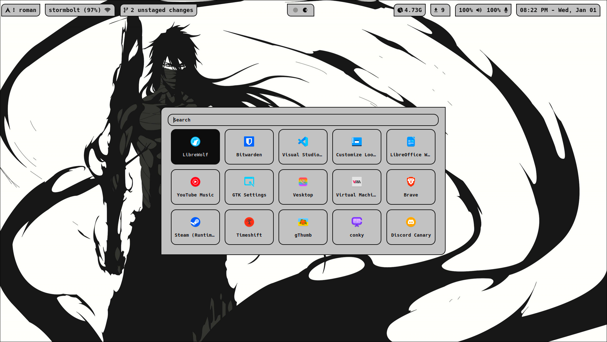

Arch Linux - Hyprland

*NOTE: If you do not use hyprshade (or shaders in general) to enhance color vibrance, do not expect the hex colors in these files to look like this on your screen(s).*

Colors grabbed using pywal16

Theme Switching Menu powered by rofi

Peaceful Pond Theme

Gruvbox Theme

Purple Abyss Theme

Mugetsu (Bleach) Theme

